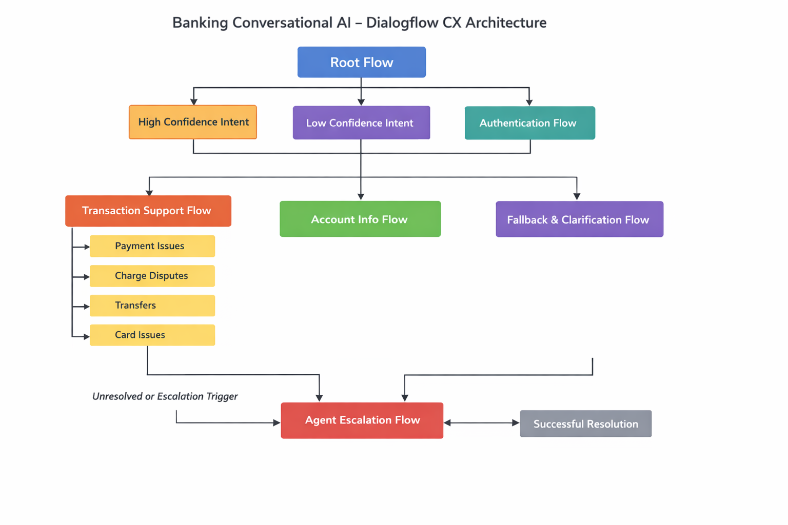

# Dialogflow CX Flow Architecture

This document outlines the conversational flow design derived from linguistic and NLP error analysis.

## Root Flow
Handles initial routing and intent detection.

## Authentication Flow
Validates user identity before accessing sensitive banking actions.

## Transaction Support Flow
Routes transaction-related intents into specialized subflows:
- Payment Issues
- Charge Disputes
- Transfers
- Card Issues

## Account Information Flow
Supports balance inquiries, statements, and profile management.

## Fallback & Clarification Flow
Handles ambiguity, low confidence predictions, and multi-intent queries.

## Agent Escalation Flow
Transfers unresolved cases to human agents.
