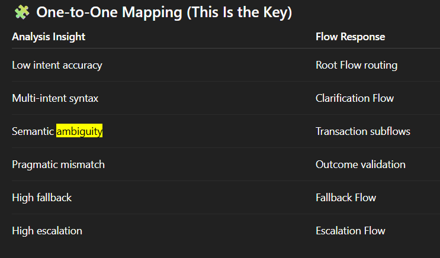

## Dialogflow CX
-  “Dialogflow CX is Google Cloud’s state-based conversational AI platform, designed to manage complex, multi-turn enterprise conversations through modular flows and pages.”

#### Dialogflow CX is Google Cloud’s enterprise platform for building conversational AI (chatbots and voicebots).
    - The system that decides how a conversation flows, not just what an intent is.

#### Basic Chatbots - Traditional / Simple Bot:
    - Flat list of intents
    - One response per intent
    - Breaks easily with complex conversations

#### Dialogflow CX :
    - State-based conversation flows
    - Multi-step dialogs
    - Context-aware routing
    - Designed for enterprise use cases (banking, healthcare, retail)
##### That’s why CX is used by banks, airlines, insurance, retail giants.

## 🧩 Core Concepts (As Mapped to My Project):

### 1️⃣ Flows
- A Flow is a major conversation module.

#### Examples from your project:
- Transaction Support Flow
- Authentication Flow
- Fallback & Clarification Flow
Note: I have designed these flows based on the error analysis.

### 2️⃣ Pages
- Pages are states inside a flow.

#### Example:
- Transaction Support Flow
    - ├── Identify Issue Page
    - ├── Clarify Entity Page
    - ├── Resolve Issue Page
    - └── Confirm Resolution Page

#### Find them at pages are where:
    - Prompts happen
    - Parameters are collected
    - Decisions are made

### 3️⃣ Intents
 -Intents capture what the user wants to do.

### Example:
- report_charge_issue
- make_payment
- card_declined

### Find them in my project where:
- I analyzed intent accuracy
- Found misclassification
- Improved how intents are routed

### 4️⃣ Entities
 - Entities extract key information from user input.

### Examples:
- Transaction type
- Amount
- Account type

### My semantic analysis showed that:
- Weak entity resolution → confusion
- Dialogflow CX fixes this with custom entities.

### 5️⃣ Routes & Conditions
- This is where CX shines.

#### You can route based on:
- Intent
- Entity values
- Confidence
- Conversation state

#### Example:
- If confidence < 0.6 → Clarification Flow
- That directly ties to our fallback strategy.

## As Explained in my project:
### EX: 🏦 Banking Example (Simple)

#### User: “I was charged twice and need help”

#### Dialogflow CX:
- Root Flow detects transaction topic
- Transaction Support Flow starts
- Entity clarification: charge type
- Resolution page
- Outcome confirmation
- Escalate only if needed

-------------------------------------------------------------------------------------------------------
## How the Flow Architecture Is Directly Related to Our Analysis
- Each flow exists because of a failure pattern you discovered in the data.
    - Data → Linguistic failures → CX risks → Flow design

### Root Flow: What the Root Flow Does
- First contact with the user
- Performs high-level intent detection
- Routes to the correct specialized flow

### Our Analysis: Root Flow isolates complexity early
. Prevents semantic overload
. Reduces early misrouting
#### Example: confusion matrix + accuracy (60%):
- Some intents are frequently confused
- One “flat” model cannot handle everything

#### Authentication Flow — Addresses pragmatic failures (correct intent, wrong outcome):
. Reduces failed transactions
. Improves trust
. Prevents CX breakdowns
#### Example: 
- Users escalate even when intent is correct
- Sensitive actions fail without proper context

### Transaction Support Flow — Ambiguity, Semantic & Syntactic Errors
#### Our Project we found:
. Ambiguous terms: charge, payment, transfer

#### Semantic confusion:
- Payment Issues-> Semantic ambiguity
- Charge Disputes-> Overlapping terminology
- Transfers-> Entity confusion
- Card Issues-> Context-dependent meaning

### Account Info Flow — Low-Risk, High-Frequency Queries
- Separates: Informational intents & transactional risk
- reduces fallback and escalation.

#### Problem we Observed
. Simple queries mixed with complex ones
. Causing unnecessary fallback

### Fallback & Clarification Flow — Direct Fix for Fallback Rate (40%)
- Asks clarifying questions
- provides design opportunity
- Decomposes syntax
- Disambiguates semantics

#### Example:
. Fallback rate = 0.4 which is high.

### Agent Escalation Flow — Cost & CX Control
. Collects context
. Avoids blind handoff
. Improves agent efficiency
. Ensures intension should be intentional and context rich.

#### Example: 
- Escalation rate = 20%

Note: “Each Dialogflow CX flow was intentionally designed based on observed linguistic failure patterns, ensuring that conversational architecture directly mitigates syntactic, semantic, and pragmatic errors identified in the data.”
